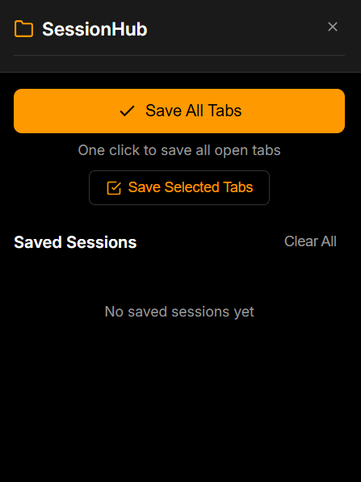
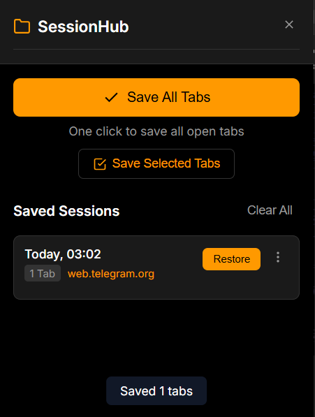
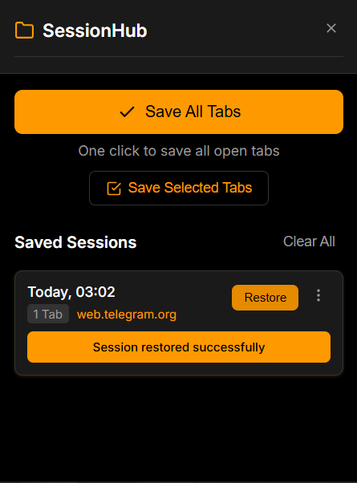
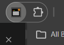

# SessionHub – Tab Saver & Session Manager

## Short Description
SessionHub is a lightweight Chrome extension that helps users manage their browser tabs efficiently. It allows you to save all open tabs or selected tabs into organized sessions that can be restored later, perfect for researchers, developers, and anyone who works with multiple browser windows and needs to maintain a clean, organized workspace.

## Overview
SessionHub solves the common problem of tab overload that slows down browsers and reduces productivity. Too many open tabs consume memory, make it difficult to find important content, and create digital clutter. This extension enables users to save all open tabs or selected tabs into timestamped sessions, restore them later with one click, and maintain a clean browsing environment. All data is stored locally using Chrome's Storage API, ensuring privacy with no backend servers or tracking.

## 🚀 How to Download & Use

1. **Download the extension files:**
   - Click the green "Code" button above and select "Download ZIP"
   - Extract the ZIP file to a folder on your computer

2. **Load the extension in Chrome:**
   - Open Chrome browser
   - Type `chrome://extensions/` in the address bar and press Enter
   - Enable "Developer mode" using the toggle in the top-right corner
   - Click the "Load unpacked" button that appears
   - Navigate to and select the extracted "SessionHub extension" folder
   - Session Hub will now appear in your browser toolbar

3. **Load the extension in Edge:**
   - Open Edge browser
   - Type `edge://extensions/` in the address bar and press Enter
   - Enable "Developer mode" using the toggle in the bottom-left corner
   - Click the "Load unpacked" button
   - Navigate to and select the extracted "SessionHub extension" folder
   - SessionHub will now appear in your browser toolbar

## Key Features
- Save all open tabs in one click
- Save selected tabs (user can choose which tabs to save)
- Multiple saved sessions with automatic timestamps
- Restore sessions in one click
- Rename and delete saved sessions
- Local storage using Chrome Storage API (no backend, no tracking)
- Clean, minimal popup interface

## Tech Stack
- HTML
- CSS
- JavaScript
- Chrome Extension APIs
- Chrome Storage API

## Architecture
SessionHub is built as a standard Chrome extension with a popup-based user interface. The popup UI handles user interactions for saving and restoring sessions, while the background logic manages tab operations using Chrome's Tabs API. All session data is stored locally using the Chrome Storage API, ensuring fast access and complete privacy without requiring any external servers or databases.

## Screenshots / Preview

### Main Interface

### Saving Tabs

### Restoring Sessions

### Extension in Browser

## License
This project is licensed under the MIT License - you are free to use, modify, and distribute this software as permitted by the license terms.

## Author
**Drishti Chaudhary**
- Email: drishtichaudhary616@gmail.com
- LinkedIn: https://www.linkedin.com/in/drishti-chaudhary-047855206/
- GitHub: https://github.com/drishtichaudhary
- Portfolio: https://drishtichaudhary.github.io/Portfolio-site/
